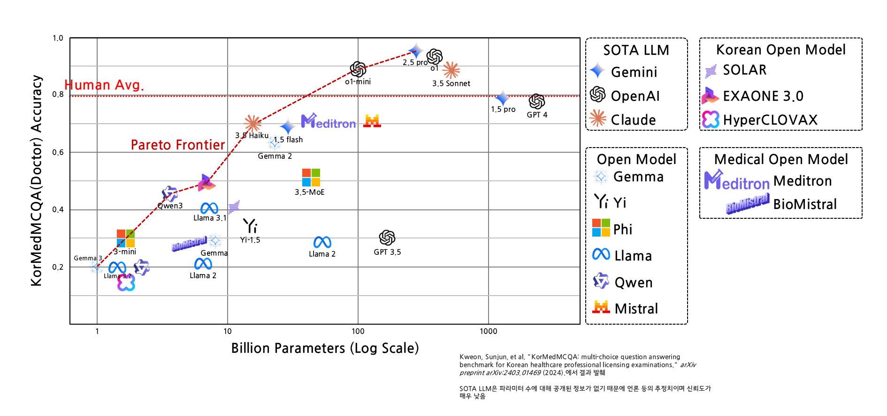
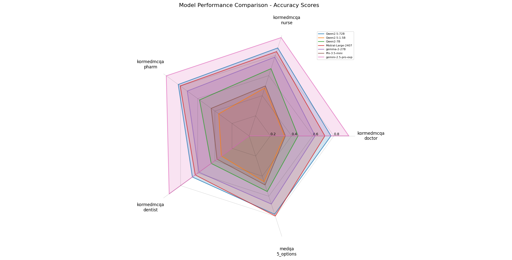

# README

- 하단의 모델 외에는 [KorMedMCQA: Multi-Choice Question Answering Benchmark for Korean Healthcare Professional Licensing Examinations의 Appendix C](https://doi.org/10.48550/arXiv.2403.01469)에서 가져옴
- Closed Model의 파라미터는 추정 값

## 참고 문헌 및 자료

- [Kweon, S., Choi, B., Chu, G., Song, J., Hyeon, D., Gan, S., ... & Choi, E. (2024). KorMedMCQA: multi-choice question answering benchmark for Korean healthcare professional licensing examinations. arXiv preprint arXiv:2403.01469.](https://doi.org/10.48550/arXiv.2403.01469)

## 데이터셋

- 영어, 한국어 데이터셋으로 sLLM 진단 결과 측정
- 영어
  - [MedQA](https://github.com/jind11/MedQA)
    - 미국 의사 면허 시험(USMLE)을 기반으로 한 12,000여 개의 문제로 구성
- 한국어
  - [KorMedMCQA](https://huggingface.co/datasets/sean0042/KorMedMCQA)
    - 한국 의료 면허 시험을 기반으로 7,469개의 문제로 구성
    - train dataset만 Gemini 2.5 Pro (03-26 exp)로 합성 데이터 생성 후 사용
  - [Asan-AMC-Healthinfo](https://huggingface.co/datasets/ChuGyouk/Asan-AMC-Healthinfo)
    - 19.2k 분량
    - 서울아산병원 건강정보의 의료정보에 대한 데이터

## Requirements

### Base Model

- MedGemma3 27B

### SFT

- 한국어 데이터로만 fine tuning, 약 26K 분량
- `max_length=1024`, `per_device_train_batch_size=4`, `epoch=1`
- 전체 bfloat16 기반

### Benchmark

|Dataset|Acc|F1|
|:--|:--:|:--:|
|KorMedMCQA dentist|||
|KorMedMCQA doctor|||
|KorMedMCQA nurse|||
|KorMedMCQA pharm|||
|MedQA 5 options|||
|MedQA 4 options|||

### Knowledge Distillation

- [KorMedMCQA의 train data만 (약 3.4K) Gemini에게서 합성데이터 획득](fine_tuning/data/distillation_gemini)

### Vector DB/RAG

- ChromaDB 사용
- 유사도 임계치는 0.4, 상위 5개 문서 검색

### LLM cache

### vLLM

- 

### KV cache

- 

### MQA/GQA

- Gemma3는 GQA를 사용한 아키텍처

### PEFT

- BnB 4bit QLoRA 사용
  - `r=16`, `a=32`, `target_modules=["q_proj", "k_proj", "r_proj", "out_proj"]`
- Gradient Accumulation 사용, step은 1024
- Gradient Checkpoint 사용
- huggingface의 `accelerate`를 이용해 분산 학습

### LLM Agent

- AutoGen 사용

### English-Korean Translation

### etc

- Falsh Attention 2 대신 Gemma의 권장사항에 따라 eager를 사용